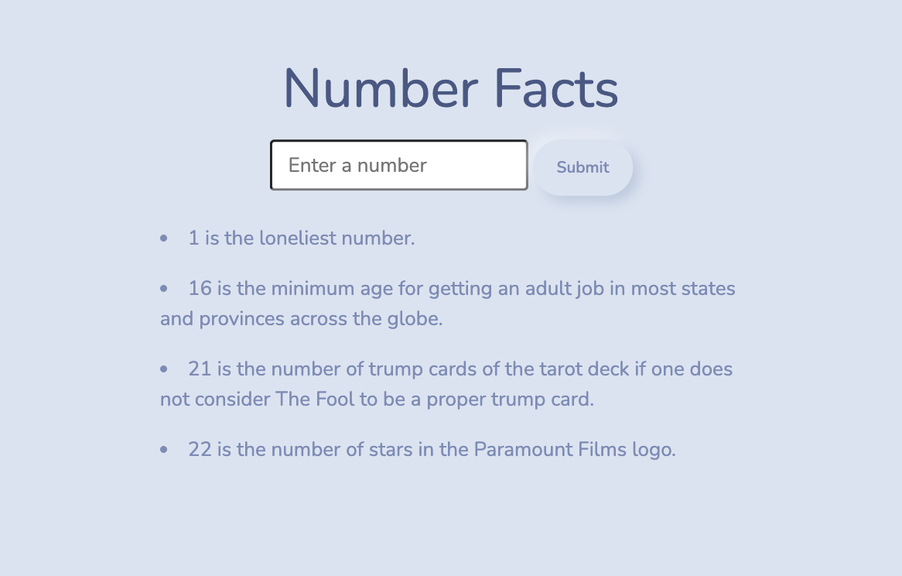

# **Number Facts**

### **WARNING**

> Mixed Content: The page at '<URL>' was loaded over HTTPS, but requested an insecure XMLHttpRequest endpoint '<URL>'. This request has been blocked; the content must be served over HTTPS.

_An error occurs with Github security. The Numbers API does not use HTTPS and will not work otherwise. The only way to run the site is to clone the repository onto your local computer or to 'Allow Insecure Content' in your browser settings._

## **Overview**

The main feature of this application is to allow users to get random facts about their favorite number or any number they choose.

## **API**

This application was created using data from the [<ins>**NumbersAPI**</ins>](http://numbersapi.com/). All facts are sourced from the API's database.

## Technologies Used:

- [HTML](https://developer.mozilla.org/en-US/docs/Web/HTML)
- [CSS](https://developer.mozilla.org/en-US/docs/Web/CSS)
- [jQuery](https://api.jquery.com)
- [VSCode](https://code.visualstudio.com/docs)
- [Bootswatch](https://bootswatch.com/morph/)
